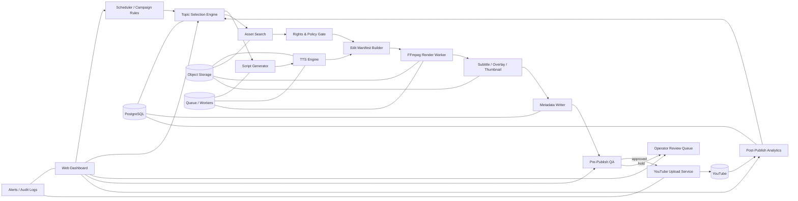

# 유튜브 쇼츠 자동 업로드 웹 기반 자동화 프로그램 기획안

**Executive Summary**  
한국어권 유튜브 쇼츠 자동화 시스템은 “완전 무인 대량 생산”보다 **한국어 주제선정 엔진 + 저작권·정책 게이트 + 반자동 승인 중심의 웹 운영 체계**로 설계하는 편이 현실적이다. 이유는 한국에서 숏폼 소비가 매우 강하고, 유튜브 내 한국 트렌드도 개인 크리에이터형·코미디·푸드·음악/팬덤·일상형 소재에 집중되지만, 동시에 유튜브가 반복적·대량 자동생산물, 부적절한 AI/저작권 사용, 반복·비진정성 콘텐츠에 대해 명확한 제약을 두고 있기 때문이다. citeturn13view0turn20view0turn27view0turn44search0turn44search1

## 우선 참고 출처와 조사 기준

본 기획안은 **한국어권 공식/원문 자료를 최우선**으로 두고, 그다음으로 글로벌 공식 문서와 공급사 공식 문서를 참조했다. 투자 판단과 운영 정책에 직접 영향을 주는 항목은 가급적 YouTube 공식 문서, 한국 정부·공공 연구, Google·OpenAI·클라우드 공급사의 공식 문서에 근거했다. citeturn27view0turn16view0turn13view0turn41search19turn32view0

| 우선순위 | 출처군 | 이 보고서에서의 용도 |
|---|---|---|
| 높음 | YouTube Korea 블로그, YouTube Help, YouTube Developer Docs citeturn27view0turn28view1turn43view0turn41search19 | 한국 유튜브 트렌드, 쇼츠 정책, 업로드 방식, 저작권·AI 라벨링, API 제약 |
| 높음 | KISDI, 여성가족부 등 한국 공공·정책 자료 citeturn16view0turn17view0turn13view0 | 한국 시청 행태, YouTube 내 콘텐츠 유형, 숏폼 이용률 |
| 중간 | Think with Google / YouTube Culture & Trends 공식 자료 citeturn23view0turn29view0turn11view0 | 음악·챌린지·팬덤·버추얼/댄스·글로벌 포맷 진화 |
| 중간 | Google Cloud, OpenAI, 콘텐츠 API 공급사 공식 문서 citeturn33search0turn33search2turn32view0turn34search0turn34search3 | API 용도, 과금 구조, 통합 포인트 |
| 낮음 | 2차 시장자료·검색 스니펫 citeturn22search0turn22search2 | 쇼츠 카테고리별 방향성 참고용 보조 자료 |

**해석상 주의점**도 분명하다. 2026년 현재 공개된 자료 중에는 “한국어 기준 유튜브 쇼츠만을 대상으로 한 완전한 공식 장르 순위표”가 제한적이므로, 이 보고서는 **한국 유튜브 전체 이용행태(KISDI) + 한국 유튜브 연말/트렌드 공식 블로그 + 쇼츠 전용 공식 정책·트렌드 자료**를 합쳐 실무적으로 의미 있는 우선순위를 재구성했다. 따라서 아래의 소재 우선순위는 **절대 순위라기보다 ‘기획 우선순위’**로 읽는 것이 맞다. citeturn16view0turn20view0turn27view0turn28view1

## 주제선정 엔진 설계

한국 유튜브 이용행태를 보면 최근 1개월 동안 유튜브에서 가장 자주 본 콘텐츠 유형 1위는 **국내 인터넷 개인방송 영상 27.3%**였고, 그 뒤를 **국내 방송 예능/오락 14.7%, 기타 국내 개인 제작 동영상 14.7%, 국내 뉴스/시사 11.8%, 국내 방송 드라마 7.8%**가 이었다. 동시에 한국 청소년의 지난 1년간 가장 많이 이용한 미디어가 숏폼 콘텐츠였고 그 비율은 **94.2%**였다. 즉, 쇼츠 시스템의 시작점은 “짧고 강한 훅” 자체보다도 **한국어권에서 이미 먹히는 개인 크리에이터형 문법**을 얼마나 짧게 압축하느냐에 맞춰야 한다. citeturn20view0turn13view0

YouTube Korea의 공식 연말 자료를 보면 2021년 한국 인기 쇼츠 크리에이터에서는 **쿡방·레시피, 댄스, 코미디**가 두드러졌고, 2022년 최고 인기 쇼츠에는 **1분 요리**와 **자동차/수리형 짧은 정보 콘텐츠**가 포함됐다. 2024년 한국 유튜브 트렌드에서는 **스포츠·아티스트·TV 프로그램 팬덤**, **가까운 사람·반려동물·가족이 등장하는 힐링형 일상**, **케이팝 노래를 활용한 쇼츠 댄스 트렌드**, **크리에이터가 스스로 노래를 만들고 밈을 확산시키는 구조**가 공식적으로 강조됐다. citeturn28view1turn28view0turn27view0

글로벌 공식 자료도 한국어권 기획에 중요한 힌트를 준다. Think with Google은 2025년 YouTube 트렌드에서 **Shorts가 음악 발견의 허브**가 되었다고 설명했고, 2026년 YouTube Culture & Trends는 K-pop 팬덤 안에서 **댄스 커버, 팬캠, 리액션, 해설/딥다이브형 영상**이 중요한 커뮤니티 형식이라고 정리했다. 한국 유튜브 생태계는 이미 팬덤과 창작자가 함께 트렌드를 만드는 구조이므로, 단순 뉴스 요약보다 **팬덤 참여형 포맷**이 더 유리할 가능성이 크다. citeturn23view0turn29view0

보조 자료 기준으로는 한국의 YouTube Shorts 선호 카테고리에서 **humor/gag, entertainment, pets, restaurants/food, everyday life of celebrities**가 상위권으로 제시된다. 이 수치는 2차 인용이므로 의사결정의 직접 근거보다는 KISDI·YouTube Korea 자료와 같은 방향을 가리키는 참고 신호로 쓰는 편이 안전하다. citeturn22search0turn22search2

### 한국어 기준 상위 소재군 정리

| 우선도 | 소재군 | 조사 근거 | 권장 포맷 | 저작권/정책 리스크 |
|---|---|---|---|---|
| 높음 | 공감형 코미디·상황극·짧은 스토리 | 한국 유튜브 공식 연말 트렌드에서 코미디·하이퍼리얼리즘·공감형 일상 문법이 반복적으로 부상 citeturn25search0turn26view0turn28view1 | 20~45초, 1상황 1반전, 큰 자막 중심 | 낮음 |
| 높음 | 푸드·초간단 레시피·먹방/요리 재현 | 2021 인기 쇼츠 크리에이터 다수가 쿡방/레시피, 2022 인기 쇼츠 1위가 1분 요리, 2024 팬덤형 요리 재현 확산 citeturn28view1turn28view0turn27view0turn24search16 | 20~60초, 재료 3단계, 손동작+텍스트 | 낮음~중간 |
| 높음 | K-pop·댄스 챌린지·팬덤 반응·팬캠/리액션 | 2024 한국 쇼츠 트렌드, 2025 Shorts의 음악 허브화, 2026 K-pop 팬덤의 댄스 커버·팬캠·리액션 구조 citeturn27view0turn23view0turn29view0 | 15~30초 챌린지, 30~60초 팬 반응/밈 | 중간~높음 |
| 높음 | 일상형 개인 크리에이터·가족/반려동물·힐링 | KISDI에서 개인방송형이 유튜브 최다, 2024 한국 인기 크리에이터에서 부부·반려묘·아이 일상형 채널 강세 citeturn20view0turn27view0 | 대화 재연, 캡션형 애니메이션, 반려동물 상황극 | 낮음 |
| 중간 | 스포츠·TV·아티스트 팬덤 파생 소재 | 2024 한국 유튜브는 스포츠·TV·아티스트 팬덤의 공간이며, 팬 콘텐츠 소비가 매우 활발 citeturn26view1turn27view0 | 반응, 해설, 팬 참여형 밈 | 높음 |
| 중간 | 1분 지식·생활 팁·수리·차량·실용 정보 | 2021 한국 급성장 크리에이터에 1분 지식형 채널 존재, 2022 인기 쇼츠에 카센터 수리형 정보 포함, 전체 유튜브에서 뉴스/시사 비중도 의미 있음 citeturn28view1turn28view0turn20view0 | 30~60초, “문제-해결-결론” 구조 | 중간 |

**실무 권장 해석**은 명확하다. 초기 파일럿은 **공감형 코미디 + 푸드 + 일상/반려동물 + 저작권 안전한 정보형**으로 시작하고, **K-pop·스포츠·TV 팬덤 소재는 2단계 이후**에만 넣는 것이 좋다. 팬덤 소재는 조회수 잠재력이 높지만, 음악·방송·리그 영상 재사용 위험이 높고, 1분을 넘는 쇼츠에서는 활성 Content ID 청구가 있으면 전 세계 차단까지 발생할 수 있다. citeturn43view0turn43view3

### 주제 후보 자동생성 방법

주제 후보 자동생성은 “트렌드 수집”보다 **자체 카테고리 사전 + 최신 신호 + 채널 적합도**의 결합으로 설계하는 편이 낫다. 유튜브가 반복·대량 자동생산형 콘텐츠를 스팸 정책과 수익화 정책에서 모두 문제 삼고 있기 때문에, 단일 템플릿에서 제목만 바꾸는 방식은 장기적으로 리스크가 크다. citeturn44search1turn44search0turn44search19

| 입력원 | 자동생성 방식 | 산출 예시 | 비고 |
|---|---|---|---|
| 채널 카테고리 Allowlist | `코미디 / 푸드 / 팬덤 / 반려동물 / 팁` 등 운영자가 승인한 주제군만 활성화 | “직장인 공감”, “3재료 레시피”, “반려묘 대화극” | 초기 안정화 핵심 |
| YouTube 한국 트렌드/연말 리스트 | 공식 트렌드 문구를 키워드 클러스터로 분해 | `올림픽 반응`, `흑백요리사 재현`, `APT 챌린지` | 최신성 보강 citeturn27view0turn26view1 |
| YouTube Data API 검색 결과 | `search.list`, `videos.list` 기반으로 최근 관련 영상군의 제목·태그·조회 흐름을 수집 | `K-pop dance cover`, `1 minute recipe` | 업로드·검색 쿼터 관리 필요 citeturn41search19turn41search16turn41search1 |
| 내부 성과 로그 | 최근 CTR, 초반 이탈, 평균 시청지속률, 업로드 시간대 성과를 역피드백 | “밤 업로드에서 반려동물 강세” | 가장 신뢰도 높음 |
| 캠페인/이벤트 캘린더 | 컴백, 시즌, 스포츠 일정, 명절/시험기간 등 운영자 입력 | “여름 간식”, “수능 공감”, “월드컵 응원” | 사용자 입력 기반 |

### 주제 추천 알고리즘 설계

권장 스코어링은 다음과 같다.

```text
최종점수 = 0.40 * 조회수잠재력
         + 0.25 * 경쟁도역점수
         + 0.20 * 제작난이도역점수
         + 0.15 * 저작권안전점수
         - 반복유사도패널티
         - 정책위험패널티
```

이 가중치는 사용자 요청의 우선순위와 일치하게 **조회수 잠재력 > 경쟁도 > 제작 난이도 > 저작권 위험** 순서로 설계했다. 다만 실제 운영에서는 저작권·정책 리스크가 일정 임계치를 넘으면 점수와 무관하게 **하드 컷**해야 한다. 유튜브는 자동·합성 도구로 유사 콘텐츠를 고속 양산하는 행위를 스팸 정책상 금지하고 있고, 수익화 정책에서도 반복적·대량 생산형 비진정성 콘텐츠를 문제 삼는다. citeturn44search1turn44search0turn44search22

각 항목의 세부 산식은 아래처럼 설계하는 것이 실무적이다.

| 평가축 | 세부 지표 | 계산 예시 |
|---|---|---|
| 조회수 잠재력 | 최근 7일/30일 트렌드 상승률, 유사 주제 평균 조회수, 쇼츠 적합 훅 강도, 채널-주제 적합도 | `trend_velocity`, `median_views`, `hook_score`, `channel_fit` |
| 경쟁도 | 최근 상위 결과의 채널 집중도, 동일 키워드 일간 업로드량, 공식 채널 점유율 | `top10_concentration`, `uploads_per_day`, `official_share` |
| 제작 난이도 | 얼굴 촬영 필요 여부, 팩트체크 강도, 애셋 수집 난도, 편집 템플릿 재사용성 | `asset_time`, `edit_time`, `fact_check_cost` |
| 저작권 안전도 | 음악 라이선스 상태, 제3자 영상 사용량, 방송/경기 화면 필요성, 유명인 초상·보이스 사용 여부 | `licensed_music`, `third_party_video_ratio`, `likeness_risk` |
| 반복 유사도 패널티 | 최근 20개 업로드와의 제목·대본·컷 구성 유사성 | 임계치 초과 시 -10~-30 |
| 정책위험 패널티 | AI 라벨 미부착 가능성, 반복 자동생산 패턴, 오해 유발 가능성 | 고위험이면 보류 |

**권장 하드 필터**는 네 가지다.  
첫째, **저작권 위험 High**는 자동 폐기 또는 수동 승인 대기.  
둘째, **1분 초과 쇼츠에서 청구 가능성이 있는 음악/방송 소스 포함 시 폐기**.  
셋째, **실존 인물·현실 사건을 사실처럼 보이게 하는 AI 생성물은 라벨 강제**.  
넷째, **최근 업로드와 의미·구조가 지나치게 유사하면 자동 보류**다. citeturn43view0turn43view3turn44search2turn44search9turn44search1

### 주제 후보 출력 형식

운영 화면과 API 반환은 아래 구조가 가장 실무적이다.

| candidate_id | 소재군 | 키워드 클러스터 | 한 줄 훅 | 조회수 잠재력 | 경쟁도 | 제작 난이도 | 저작권 위험 | 최종점수 | 상태 |
|---|---|---|---|---:|---:|---:|---:|---:|---|
| T-2401 | 공감 코미디 | 직장인 회식 / 상사 멘트 | “회식 끝나고 꼭 나오는 그 한마디” | 86 | 58 | 25 | 12 | 79.3 | 추천 |
| T-2402 | 푸드 | 3재료 간식 / 야식 레시피 | “전자레인지 2분 야식” | 82 | 63 | 18 | 10 | 78.6 | 추천 |
| T-2403 | K-pop 챌린지 | 신곡 포인트 안무 | “15초만에 배우는 포인트 안무” | 91 | 74 | 32 | 61 | 69.2 | 검수필수 |
| T-2404 | 반려동물 | 고양이 상황극 | “집사 출근할 때 고양이 속마음” | 77 | 47 | 16 | 8 | 76.5 | 추천 |
| T-2405 | 스포츠 팬덤 | 오늘의 장면 반응 | “3초 만에 바뀐 경기 흐름” | 88 | 69 | 34 | 78 | 60.4 | 보류 |

운영상 이 테이블에 **출처 링크, 권리 증빙 상태, AI 라벨 필요 여부, 게시 예약 시간, 담당 승인자**를 추가하면 바로 대시보드·API·워크플로우에 공용으로 사용할 수 있다. 특히 K-pop, 스포츠, 방송 파생 주제는 무조건 “검수필수” 또는 “보류” 경로를 거치게 하는 편이 안전하다. citeturn27view0turn43view4turn44search2

## 전체 파이프라인 아키텍처

이 시스템의 기본 원칙은 **“생성은 자동화, 권리와 게시는 통제”**다. 유튜브에는 전용 “Shorts 업로드 API”가 따로 있는 것이 아니라, 일반적인 비디오 업로드(`videos.insert`)로 올린 세로형·정사각형 3분 이하 영상을 쇼츠 조건에 따라 Shorts로 분류하는 구조로 이해하는 것이 실무적으로 타당하다. 또한 기본 할당량 기준으로 `videos.insert`는 일일 100회, YouTube Data API의 기타 엔드포인트는 기본적으로 일일 10,000 units 수준의 쿼터 관리가 핵심이므로, 설계 초기에 **업로드량·검색량·다중 채널 수**를 함께 제어해야 한다. citeturn41search11turn43view0turn41search1turn41search5



위 구조에서 가장 중요한 점은 **주제 선정, 애셋 확보, 렌더링, 업로드를 각각 독립 작업으로 쪼개고**, 모든 산출물을 DB와 오브젝트 스토리지에 단계별로 남기는 것이다. 이렇게 하면 업로드 직전 실패가 발생해도 전체 파이프라인을 처음부터 다시 돌릴 필요가 없고, 저작권 게이트에서 막힌 건만 별도 검토 큐로 보낼 수 있다. 유튜브 측도 OAuth 2.0 기반 권한 위임, 업로드 API, 권리 관리 도구를 각각 별도 계층으로 제공하므로 모듈 분리가 맞다. citeturn41search2turn41search3turn43view1turn43view2

### 모듈별 기능

| 모듈 | 핵심 기능 | 입력 | 출력 | 권장 운영 포인트 |
|---|---|---|---|---|
| 주제선정 | 카테고리 필터, 트렌드 수집, 후보 점수화 | 카테고리, 트렌드, 과거 성과 | 후보 리스트 | 반자동 승인 기본 |
| 스크립트 생성 | 훅, 본문, CTA, 금칙어·길이 조정 | 후보 주제 | 쇼츠용 스크립트 | 45초 이하 기본, 3분은 예외 |
| 음성합성 | TTS 생성, 발화 속도·톤 AB 테스트 | 스크립트 | WAV/MP3 | 브랜드별 보이스 고정 |
| 영상소스 수집/편집 | 소스 검색, 라이선스 체크, 컷 편집 | 주제, 키워드 | 원본/컷리스트 | 라이선스 없으면 중단 |
| 자막/오버레이 | STT 보정, 강세 자막, 강조 키워드 | 렌더 초안 | 자막 트랙, 오버레이 | 모바일 가독성 우선 |
| 썸네일 생성 | 업로드용 커버·프레임 생성 | 장면 키프레임, 카피 | 썸네일 이미지 | 쇼츠는 피드 첫프레임도 중요 |
| 메타데이터 작성 | 제목, 설명, 해시태그, AI 라벨/권리표기 | 스크립트, 주제, 권리 정보 | 업로드 메타데이터 | AI 라벨·권리 체크 강제 |
| 업로드 | OAuth 토큰 사용, 예약 게시, 상태 수집 | 영상 파일, 메타데이터 | YouTube video id | 재시도·idempotency 필수 |

### 에러 및 재시도 정책

| 실패 지점 | 전형적 원인 | 권장 정책 |
|---|---|---|
| YouTube API 429/5xx | 쿼터 소진, 일시 장애 | 지수 백오프, 예약 큐 이동, 일일 쿼터 보호 |
| 업로드 중단 | 네트워크 끊김, 토큰 만료 | 체크포인트 저장 후 재업로드, OAuth refresh 재시도 |
| TTS 실패 | 공급사 장애, 텍스트 포맷 오류 | 대체 보이스 공급사 fallback, SSML 제거 후 재시도 |
| 애셋 수집 실패 | 검색 결과 부족, 라이선스 불명확 | 대체 무료/보유 애셋 라이브러리로 전환, 없으면 보류 |
| 렌더 실패 | FFmpeg 오류, 자막 인코딩 문제 | 동일 manifest 재실행, 다른 워커로 재처리 |
| 정책 게이트 실패 | AI 라벨 누락, 반복성 높음, 권리 불명확 | 무조건 운영자 큐로 이동, 자동 게시 금지 |

이 정책에서 핵심은 **재시도 가능한 오류와 재시도하면 안 되는 오류를 분리**하는 것이다. API 장애·네트워크·렌더 오류는 재시도 대상이지만, 권리 불명확·정책 위험·반복 유사도 과다는 재시도보다 **검수 큐**가 맞다. 유튜브는 대량 자동생산·반복형 업로드를 스팸으로 볼 수 있고, 수익화 정책상 반복·비진정성 콘텐츠도 불리하게 다룬다. citeturn44search1turn44search0turn44search19

### 확장성과 보안 고려사항

작업 큐는 **Celery + RabbitMQ** 조합이 가장 무난하다. Celery는 실시간 처리와 스케줄링을 모두 지원하는 분산 작업 큐이고, RabbitMQ는 안정적인 메시징 브로커이며 중요한 데이터에는 durable queue 사용이 권장된다. 반면 Redis Pub/Sub은 공식 문서상 **at-most-once** 전달이므로, 업로드·렌더와 같은 중요한 작업의 “유일한” 내구성 계층으로 쓰기엔 부적합하다. Redis는 캐시·실시간 상태 브로드캐스트용으로만 쓰는 편이 좋다. citeturn38search0turn38search11turn40search0turn40search4turn40search13turn39search8

보안 측면에서는 **OAuth 토큰과 API 키를 Secret Manager에 저장하고**, 비밀 접근 권한은 업로드 서비스와 운영자 백엔드만 갖게 해야 한다. Secret Manager는 비밀 데이터를 저장·관리하는 전용 서비스이며 저장 시 암호화를 기본으로 수행한다. 또 Google OAuth 문서대로 웹 서버 앱은 access token, refresh token, scope, redirect URI를 분리 관리해야 한다. citeturn36search7turn35search15turn41search2turn41search20

## 웹 대시보드 운영 설계

대시보드는 “영상 결과물 보기”보다 **파이프라인 상태 판단과 리스크 통제**를 중심에 둬야 한다. 이 시스템의 운영 가치는 영상 생성 자체보다 **어떤 후보가 왜 올라가고 왜 보류되었는지**, 그리고 **어느 단계에서 비용·시간·권리 리스크가 발생하는지**를 한 화면에서 읽는 데 있다. citeturn43view2turn44search1turn44search2

### 파이프라인 진행상태 표시 항목

| 상태 항목 | 의미 | 표시 방식 |
|---|---|---|
| Job ID / Channel | 작업 식별자와 채널 | 상단 고정 |
| Topic score | 주제 점수 및 추천 이유 | 배지 + 툴팁 |
| Script status | 대본 생성 여부, 길이, 금칙어 경고 | 초록/노랑/빨강 |
| TTS status | 보이스, 길이, 실패 횟수 | 오디오 아이콘 |
| Asset rights | 소스별 라이선스 상태 | Low / Review / Block |
| Render progress | FFmpeg 진행률, 예상 잔여 시간 | progress bar |
| Metadata check | 제목/해시태그/AI 라벨/설명 | 체크리스트 |
| Upload status | 예약/업로드 중/게시 완료/실패 | 단계 배지 |
| Post-publish | video id, 초기 조회수, 클레임 여부 | 링크 + 알림 |
| Retry / Audit | 재시도 횟수, 담당자, 마지막 변경시각 | 로그 패널 |

### UI/UX 흐름

권장 UX는 **캠페인 생성 → 주제 후보 승인 → 스크립트 수정 → 권리 검토 → 예약 업로드 → 초반 성과 모니터링**의 순서다. 완전 자동 모드에서도 사용자는 언제든지 후보를 잠그거나 폐기할 수 있어야 하며, 실패한 작업은 “기술 오류”와 “정책/권리 오류”가 명확히 분리되어야 한다. 후자는 단순 재시도 버튼이 아니라 **검수 사유**를 보여줘야 한다. citeturn44search1turn44search2turn43view4

| 화면 | 주요 위젯 | 목적 |
|---|---|---|
| Overview | 채널별 오늘 작업 수, 성공률, 보류 수, 쿼터 사용량 | 운영 총괄 |
| Topic Lab | 후보 테이블, 점수 분해, 승인/폐기 버튼 | 주제 선정 |
| Job Detail | 스크립트, 오디오, 소스, 렌더 미리보기, 로그 | 개별 작업 제어 |
| Rights Center | 라이선스 증빙, Content ID 위험, AI 라벨 필요 여부 | 리스크 통제 |
| Upload Calendar | 예약 시간표, 채널별 슬롯, 우선순위 | 게시 운영 |
| Analytics | 초기 조회수, retention, CTR proxy, 클레임 발생률 | 피드백 루프 |
| Audit / Logs | 사용자 활동, 재시도 히스토리, 토큰 사용기록 | 감사·문제분석 |
| Settings | 보이스, 템플릿, 금칙어, 채널 OAuth 연결 | 설정 관리 |

### 알림, 로그, 권한관리, 운용 모드

알림은 최소한 **API quota 임계치**, **권리 검토 실패**, **업로드 실패**, **게시 후 Content ID/저작권 문제**, **AI 라벨 누락 위험**, **반복 유사도 과다**에 대해 발송해야 한다. 로그는 구조화 JSON으로 남기고, 작업 단위·채널 단위·운영자 단위 검색이 가능해야 한다. citeturn41search1turn43view4turn44search2

권한은 네 단계가 적합하다.  
운영관리자(Admin)는 채널 연결·권한·비밀 접근을 담당하고, 편집자(Editor)는 스크립트·썸네일·자막만 수정하며, 운영자(Operator)는 승인·예약·재시도를 담당하고, 감사자(Auditor)는 읽기 전용으로 로그와 권리 증빙만 본다. 실제로는 YouTube OAuth 연결 권한과 내부 편집 권한을 분리해야 한다. citeturn41search2turn36search9

운용 모드는 세 가지가 좋다.

| 모드 | 설명 | 권장 사용 시점 |
|---|---|---|
| Manual | 주제부터 업로드까지 전부 수동 승인 | 초기 파일럿, 고위험 카테고리 |
| Semi-auto | 생성·렌더는 자동, 권리/게시만 승인 | **권장 기본값** |
| Auto | Low-risk allowlist에 한해 자동 게시 | 성숙 단계, 검증된 템플릿만 |

**권장 기본값은 Semi-auto**다. 이유는 유튜브가 자동·합성 도구에 의한 대량 유사 콘텐츠를 금지하고 있으며, AI 생성·변형 콘텐츠에도 라벨링 요구가 있기 때문이다. citeturn44search1turn44search2

## API·기술스택·인프라 제안

### 필요한 API 목록

아래 표는 “지금 바로 구현 가능한 조합” 기준의 권장안이다. 핵심은 **업로드/권리/AI/미디어 소스/스토리지**를 서로 분리해 교체 가능하게 만드는 것이다. citeturn41search19turn32view2turn33search0turn34search8

| API / 서비스 | 권장 용도 | 요금·제약 | 대체안 | 통합 포인트 |
|---|---|---|---|---|
| YouTube Data API v3 | 업로드, 메타데이터, 상태조회 | 기본 쿼터는 `videos.insert` 일 100회, 기타 합산 10,000 units 수준이 핵심 제약 citeturn41search1turn41search11 | Studio 수동 업로드 | `videos.insert`, `videos.list`, 스케줄러 연동 |
| Google OAuth 2.0 | 채널 권한 위임 | 비용보다 토큰·scope·refresh 관리가 핵심 citeturn41search2turn41search6 | 내부 계정 분리 운영 | 채널 연결, 토큰 갱신, role 분리 |
| YouTube Content ID API | 대형 권리자용 자동 권리관리 | **모든 개발자에게 공개된 API가 아니고 콘텐츠 파트너 전용** citeturn30search23turn43view1 | Copyright Match Tool | 엔터프라이즈 권리 운영 시만 사용 |
| Copyright Match Tool | 일반 크리에이터/권리자용 복제 탐지 | Content ID보다 관리가 쉽고 적은 리소스로 사용 가능 citeturn43view2 | 저작권 제거 요청 폼 | 게시 후 클레임 대응 |
| OpenAI Responses API | 대본, 제목, 설명, 훅 생성, 이미지 생성 | 모델·토큰 기반 과금. 예: GPT‑5.4 mini는 입력/출력 단가가 낮은 편이고, Responses API가 신규 구축 권장 경로 citeturn32view1turn32view2 | Gemini, Claude 등 | Script/metadata service, thumbnail ideation |
| OpenAI Image API | 썸네일 시안, 텍스트 기반 이미지 생성 | 이미지 토큰 기반 과금, 공식 계산기 사용 권장 citeturn32view0 | Vertex AI Imagen, 자체 템플릿 | 썸네일 후보 3~5안 생성 |
| Google Cloud Text-to-Speech | 한국어 보이스오버 | 문자 수 기준 과금, 무료 캐릭터 구간 존재 citeturn33search0turn33search1 | ElevenLabs, Azure TTS | TTS worker |
| Google Cloud Speech-to-Text | 음성 검수·자막 정합 확인 | 처리한 오디오 초 단위 과금 citeturn33search2turn33search19 | Whisper 계열 | QA captions, forced-align 검증 |
| Pexels API | 무료 사진·영상 애셋 | 공식적으로 무료 API citeturn34search0turn34search4 | Pixabay API | 무료 stock fallback |
| Pixabay API | 무료 이미지·비디오 검색 | 무료, 검색결과 노출 시 출처 표기 조건 주의 citeturn34search1 | Pexels | 무료 stock fallback |
| Storyblocks API | 상업용 영상·음악·SFX 통합 | API는 견적형, 웹 구독은 월 $21/$30/$40 플랜 존재 citeturn34search3turn34search8turn34search10 | Shutterstock API | 상업 라이선스 애셋 |
| Shutterstock API | 고품질 stock image/video | Free test + 유료 API 구독/플랫폼 라이선스 citeturn34search2turn34search9 | Storyblocks | 엔터프라이즈 소스 |
| Google Cloud Storage | 원본/중간산출물/최종본 저장 | GB-month + operation 과금. 예시 문서에 multi-region standard $0.026/GB-month 사례 제시 citeturn35search0turn42search3 | S3, R2 | asset bucket, render outputs |
| Secret Manager | 토큰·API 키 저장 | 활성 secret version/location 과 access ops 과금 citeturn36search3turn36search0 | Vault, AWS Secrets Manager | OAuth / API key 보관 |

### 권장 기술스택

권장 스택은 **Python 중심 백엔드 + 웹 대시보드 + 내구성 있는 작업 큐 + 오브젝트 스토리지**다. Python은 LLM, TTS, FFmpeg 래핑, YouTube/Google API 통합에 익숙하고, FastAPI는 타입 힌트 기반 API 서버로 성능과 생산성이 좋다. 프론트엔드는 Next.js App Router가 운영도구 UI와 서버 컴포넌트 패턴에 유리하다. 데이터 저장은 PostgreSQL, 큐는 RabbitMQ, 작업 실행은 Celery가 현실적이다. citeturn39search0turn37search15turn39search1turn38search0turn40search0

| 영역 | 권장안 | 선정 이유 |
|---|---|---|
| 백엔드 API | FastAPI + Python | API/AI/미디어 처리 친화적, 고생산성 citeturn39search0turn39search3 |
| 프론트엔드 | Next.js App Router | 운영 대시보드, SSR/Server Components 적합 citeturn37search7turn37search15 |
| DB | PostgreSQL | 신뢰성 높은 오픈소스 RDBMS citeturn39search1 |
| Queue / Worker | RabbitMQ + Celery | 메시지 내구성, 비동기 배치, 스케줄링 적합 citeturn40search0turn40search4turn38search0 |
| 캐시 / 실시간 상태 | Redis | 캐시·SSE/websocket 상태 전달용. 단, 내구성 있는 주 큐로는 비권장 citeturn39search5turn39search8 |
| 워크플로우 대안 | Airflow 또는 Temporal | 복잡한 DAG·장기 내구 실행이 필요할 때 확장 옵션 citeturn37search5turn37search9turn37search6turn37search14 |
| 영상 처리 | FFmpeg worker | 쇼츠 편집·자막 burn-in·리사이즈 표준 |
| 스토리지 | Google Cloud Storage | 산출물 버전관리와 대용량 파일 관리 용이 citeturn35search0turn42search3 |
| 비밀관리 | Secret Manager | 토큰·키 저장, 암호화, 접근통제 citeturn36search7turn35search15 |
| 배포 | Docker 기반, API/UI는 Cloud Run 또는 단일 VM, 렌더워커는 별도 worker pool | 웹과 렌더 부하 분리 |

**배포 전략**은 2단계가 좋다.  
초기에는 Docker Compose 또는 소규모 Kubernetes 없이도 가능하다. 하지만 렌더링이 늘어나면 API/UI와 워커를 분리해야 한다. API/UI는 Cloud Run 같은 서버리스에 올리고, FFmpeg/TTS/애셋 렌더 워커는 별도 워커 풀로 분리하는 구조가 운영과 비용 통제에 유리하다. Cloud Run은 사용량 기반 과금이며, 지역·리소스 설정에 따라 비용이 달라진다. citeturn35search1turn35search14

### 대략적인 월별 비용 추정

아래 추정치는 **공개 요금표를 바탕으로 한 설계 추정치**이며, 환율·트래픽·채널 수·유료 stock 사용량에 따라 크게 달라질 수 있다. 특히 **콘텐츠 라이선스와 AI 사용량이 인프라보다 비용 편차를 더 크게 만든다**는 점을 전제로 읽어야 한다. citeturn32view0turn32view1turn33search0turn34search3turn35search0turn36search3

| 운영 단계 | 가정 | 월 비용 추정 |
|---|---|---|
| 파일럿 | 1개 채널, 하루 5~10개, 무료 stock 중심, 반자동 승인 | **대략 월 $100~350** |
| 초기 상용 | 3개 채널 내외, 하루 20~30개, TTS/LLM 상시 사용, 일부 유료 stock | **대략 월 $350~1,000** |
| 확장 운영 | 다채널, 하루 50개 이상, 엔터프라이즈 stock/API, 권리관리 강화 | **대략 월 $1,000+** |

이 범위는 주로 다음 항목으로 구성된다.  
인프라는 Cloud Run/Storage/DB/Secrets, AI는 스크립트·메타데이터·썸네일 생성과 TTS/STT, 라이선스는 Storyblocks/Shutterstock 같은 상업용 stock/API다. YouTube 자체는 직접 과금보다 **쿼터 관리**가 더 중요한 변수다. citeturn41search1turn32view1turn33search0turn33search2turn34search8turn34search2

## 개발 로드맵과 리스크 관리

### 개발 로드맵

아래 일정은 **반자동 운영 기준 MVP → 베타 → 프로덕션 고도화** 순서다. 완전 자동 업로드를 초기에 넣기보다, 먼저 안전한 카테고리와 권리 게이트를 안정화하는 것이 맞다. 이 순서는 유튜브 정책 리스크 관점에서도 타당하다. citeturn44search1turn44search0

| 단계 | 기간 | 예상 인원 | 목표 |
|---|---:|---:|---|
| 요구정의·정책설계 | 2주 | 2~3명 | 카테고리 Allowlist, 권리 정책, 채널 구조, KPI 확정 |
| MVP 구축 | 4주 | 3~4명 | 주제선정, 스크립트, TTS, 업로드, 대시보드 기본 |
| 베타 확대 | 4주 | 4~5명 | 무료/유료 애셋 연동, 템플릿 렌더, 권리 게이트, 예약 업로드 |
| 운영 안정화 | 3주 | 4~5명 | 알림, 감사로그, RBAC, 재시도/장애복구, 초반 분석 |
| 고도화 | 3주 | 4~6명 | 다채널 운영, Auto mode 일부 허용, AB 테스트, 성과 루프 |

**권장 팀 구성**은 다음과 같다.  
PO/PM 0.5~1명, 백엔드·AI 엔지니어 1명, 비디오 파이프라인 엔지니어 1명, 프론트엔드 엔지니어 1명, QA/운영 0.5명 수준이면 3~4개월 내 실전형 베타가 가능하다. 얼굴·음악·스포츠 등 권리 복잡도가 높은 카테고리를 넣는 순간 법무/권리 검토 리소스가 추가로 필요해진다. citeturn43view2turn43view4turn44search2

### 테스트 및 모니터링 계획

테스트는 네 층으로 나누는 것이 좋다.  
첫째, **단위 테스트**로 스코어링·템플릿·메타데이터 생성·권리 필터를 검증한다.  
둘째, **통합 테스트**로 “주제 → 대본 → TTS → 렌더 → 업로드” 전체를 샘플 20~30개로 반복 재현한다.  
셋째, **정책 회귀 테스트**로 AI 라벨 필요 케이스, 1분 초과 음악 사용, 반복 유사 템플릿, 제3자 클립 포함 케이스를 golden set으로 관리한다.  
넷째, **운영 모니터링**으로 업로드 성공률, 재시도율, 평균 렌더 시간, 사후 클레임률, 후보→게시 전환율을 추적한다. citeturn43view0turn43view3turn44search1turn44search2

### 법적·저작권 리스크 관리 방안

| 리스크 | 영향 | 통제 방안 |
|---|---|---|
| 방송·스포츠·뮤직비디오 재사용 | 차단, 클레임, 수익화 제한 | 기본 금지, 라이선스 증빙 없으면 보류, 1분 초과 쇼츠 음악은 특별 관리 citeturn43view0turn43view3turn43view4 |
| 반복·대량 자동생산 | 스팸 판단, 수익화 불이익 | 템플릿 다양화, 유사도 패널티, 일일 업로드 캡, 반자동 승인 citeturn44search1turn44search0turn44search19 |
| AI 생성·변형 콘텐츠 미표시 | 신뢰도 훼손, 정책 위반 | realistic/meaningfully altered 판단 시 `AI use` 강제 체크 citeturn44search2turn44search9 |
| 재사용 콘텐츠 논란 | 수익화 거절 | 원본 내레이션·해설·편집 기여를 명확히 남김, 단순 짜깁기 금지 citeturn44search0turn44search19 |
| 음악·효과음 권리 불명확 | 차단, 수익화 박탈 | Shorts Audio Library / YouTube Audio Library 우선, 상업 라이선스 보관 citeturn43view0turn43view3 |
| 권리관리 도구 접근 착오 | 구현 실패 | 비파트너는 Content ID API가 아니라 Copyright Match Tool 중심 운영 citeturn30search23turn43view1turn43view2 |

**핵심 운영 원칙**은 세 가지다.  
첫째, 업로드 전 모든 영상에 대해 **권리 체크와 AI 라벨 체크를 메타데이터 단계에서 강제**한다.  
둘째, 팬덤·방송·경기 클립 사용형 주제는 기본적으로 **자동 게시 금지**다.  
셋째, “완전히 자동으로 대량 생산하는 구조”가 아니라 **승인 가능한 범위에서 템플릿을 통제하는 구조**를 유지해야 한다. 이것이 장기적으로 채널 생존성과 수익화 가능성을 높인다. citeturn44search1turn44search2turn43view4

## 단계별 산출물과 의사결정 항목

### 단계별 산출물

| 단계 | 핵심 산출물 |
|---|---|
| 요구정의 | PRD, 카테고리 Allowlist, 권리정책 문서, KPI 정의서 |
| MVP | 주제선정 엔진 명세, 대본 생성기, TTS 모듈, YouTube 업로드 모듈, 기본 대시보드 |
| 베타 | 애셋 검색 커넥터, 권리 게이트, 렌더 템플릿, 자막/오버레이 모듈, 예약 게시 |
| 안정화 | 알림 정책, 구조화 로그, RBAC, 감사 추적, 장애복구 시나리오 |
| 고도화 | 성과 피드백 루프, AB 테스트 도구, 다채널 운영 기능, 자동 모드 정책 |

### 우선순위가 높은 결정사항

| 항목 | 권장안 | 상태 |
|---|---|---|
| 운영 모드 | **Semi-auto를 기본값**으로 시작 | **[결정 우선]** |
| 시작 카테고리 | 공감 코미디, 푸드, 일상/반려동물, 저작권 안전 정보형 | **[결정 우선]** |
| 권리 정책 | 보유/라이선스/무료 허용 소스만 자동 허용, 방송·스포츠·음악 원본 클립은 원칙적 금지 | **[결정 우선]** |
| 음성 정책 | 일반 합성음성만 허용, 실존 인물 보이스 클론 금지 | **[결정 우선]** |
| 업로드 빈도 | 초기 1채널 기준 일 3~5개, 실패율과 클레임률 안정화 후 확장 | **[결정 우선]** |
| KPI | 게시 성공률, 1시간/24시간 조회수, 초기 retention, 클레임률, 후보→게시 전환율 | **[결정 우선]** |

### 현재 미정인 항목

| 항목 | 현재 상태 | 영향 |
|---|---|---|
| 목표 채널 수 | 사용자 미지정 | 쿼터·비용·권한 설계에 직접 영향 |
| 브랜드 포지션 | 사용자 미지정 | 보이스 톤, 썸네일 스타일, 카테고리 선별에 영향 |
| 예산 상한 | 사용자 미지정 | 유료 stock/음원/AI 사용 폭에 영향 |
| 게시 시간 정책 | 사용자 미지정 | 스케줄러와 성과 최적화 로직에 영향 |
| 3분 쇼츠 사용 여부 | 사용자 미지정 | 음악 권리·편집 복잡도에 영향 |
| 유료 콘텐츠 소스 사용 여부 | 사용자 미지정 | 저작권 안전성과 월 비용에 영향 |
| 법무 검토 프로세스 | 사용자 미지정 | 고위험 카테고리 확장 가능 범위에 영향 |

### Open questions / limitations

공식 한국 자료만으로는 “한국어 유튜브 쇼츠 전용 장르 점유율”의 완전한 최신 정량 랭킹이 제한적이었다. 따라서 본 보고서는 **한국 유튜브 전체 이용행태, YouTube Korea 공식 트렌드, Shorts 정책, 권리·AI 공시 정책**을 결합해 실무 우선순위를 도출했으며, 실제 개발 착수 전에는 **파일럿 채널 2~4주간 데이터 수집으로 가중치 보정**을 하는 것이 바람직하다. citeturn16view0turn20view0turn27view0turn43view0turn44search1