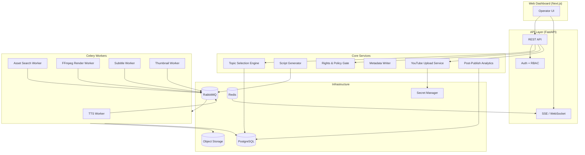
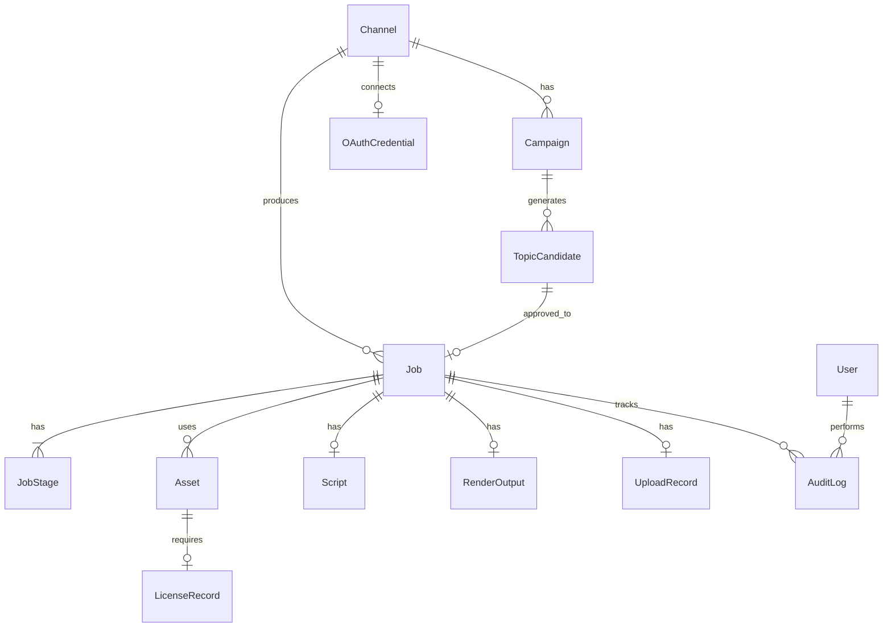

# 유튜브 쇼츠 자동 업로드 시스템 — 프로그램 설계안

> 기반 문서: [기획안.md](./기획안.md)  
> 설계 원칙: **생성은 자동화, 권리와 게시는 통제** / 기본 운영 모드 **Semi-auto**

---

## 1. 시스템 개요

### 1.1 목적

한국어권 유튜브 쇼츠를 **주제 선정 → 대본 → 음성 → 애셋 → 렌더 → 메타데이터 → 업로드**까지 파이프라인으로 처리하고, 웹 대시보드에서 **반자동 승인·권리 검토·예약 게시**를 수행하는 운영 시스템.

### 1.2 핵심 제약

| 제약 | 설계 대응 |
|---|---|
| YouTube `videos.insert` 일 100회 | 채널별 일일 업로드 캡, 예약 큐 |
| Data API 10,000 units/일 | 검색·트렌드 수집 쿼터 예산 관리 |
| 저작권·AI·스팸 정책 | Rights Gate 하드 필터, Semi-auto 기본 |
| 반복·대량 자동생산 리스크 | 유사도 패널티, 템플릿 다양화, 승인 큐 |

### 1.3 운영 모드

```text
Manual    : 모든 단계 수동 승인 (파일럿·고위험)
Semi-auto : 생성·렌더 자동, 권리·게시 승인 (기본값)
Auto      : Low-risk allowlist만 자동 게시 (성숙 단계)
```

---

## 2. 아키텍처

### 2.1 논리 구성



### 2.2 배포 토폴로지 (초기 → 확장)

| 단계 | 구성 | 비고 |
|---|---|---|
| **Phase 0 (로컬/MVP)** | Docker Compose: API + Worker + PG + RabbitMQ + Redis + MinIO | 개발·파일럿 |
| **Phase 1 (베타)** | Cloud Run(API/UI) + Worker VM pool + Cloud SQL + GCS | 렌더 분리 |
| **Phase 2 (운영)** | API/UI 서버리스 + 전용 Render pool + 모니터링 | 다채널 |

### 2.3 저장소 역할 분리

| 저장소 | 용도 |
|---|---|
| **PostgreSQL** | 작업 상태, 주제 후보, 메타데이터, 권리 증빙, 감사 로그, 성과 지표 |
| **Object Storage** | TTS 오디오, 원본 애셋, Edit Manifest, 렌더 산출물, 썸네일 |
| **Redis** | 세션, 실시간 Job 진행률, API 쿼터 카운터, SSE 브로드캐스트 |
| **RabbitMQ** | 내구성 작업 큐 (durable queue) |
| **Secret Manager** | OAuth refresh token, 외부 API 키 |

---

## 3. 프로젝트 구조

```text
유튜브_쇼츠_자동화/
├── backend/
│   ├── app/
│   │   ├── main.py                 # FastAPI 엔트리
│   │   ├── config.py               # 환경설정
│   │   ├── api/
│   │   │   ├── v1/
│   │   │   │   ├── topics.py
│   │   │   │   ├── jobs.py
│   │   │   │   ├── campaigns.py
│   │   │   │   ├── channels.py
│   │   │   │   ├── rights.py
│   │   │   │   ├── uploads.py
│   │   │   │   ├── analytics.py
│   │   │   │   ├── settings.py
│   │   │   │   └── audit.py
│   │   │   └── deps.py             # DI, RBAC
│   │   ├── core/
│   │   │   ├── security.py         # JWT, RBAC
│   │   │   ├── exceptions.py
│   │   │   └── events.py           # 도메인 이벤트
│   │   ├── models/                 # SQLAlchemy ORM
│   │   ├── schemas/                # Pydantic DTO
│   │   ├── services/
│   │   │   ├── topic_engine.py
│   │   │   ├── script_generator.py
│   │   │   ├── rights_gate.py
│   │   │   ├── metadata_writer.py
│   │   │   ├── youtube_upload.py
│   │   │   ├── quota_manager.py
│   │   │   └── similarity_checker.py
│   │   ├── workers/
│   │   │   ├── celery_app.py
│   │   │   ├── tasks_tts.py
│   │   │   ├── tasks_asset.py
│   │   │   ├── tasks_render.py
│   │   │   ├── tasks_subtitle.py
│   │   │   ├── tasks_thumbnail.py
│   │   │   └── tasks_analytics.py
│   │   └── integrations/
│   │       ├── openai_client.py
│   │       ├── google_tts.py
│   │       ├── google_stt.py
│   │       ├── youtube_api.py
│   │       ├── pexels.py
│   │       ├── pixabay.py
│   │       └── storage.py
│   ├── alembic/                    # DB 마이그레이션
│   ├── tests/
│   ├── pyproject.toml
│   └── Dockerfile
├── frontend/
│   ├── app/                        # Next.js App Router
│   │   ├── (dashboard)/
│   │   │   ├── overview/
│   │   │   ├── topics/
│   │   │   ├── jobs/[id]/
│   │   │   ├── rights/
│   │   │   ├── calendar/
│   │   │   ├── analytics/
│   │   │   ├── audit/
│   │   │   └── settings/
│   │   └── api/                    # BFF proxy (선택)
│   ├── components/
│   ├── lib/
│   ├── package.json
│   └── Dockerfile
├── workers/
│   └── ffmpeg/                     # 렌더 템플릿, 필터 프리셋
├── infra/
│   ├── docker-compose.yml
│   ├── docker-compose.prod.yml
│   └── scripts/
├── docs/
│   ├── api/                        # OpenAPI 스펙
│   └── policies/                   # 권리·카테고리 Allowlist
├── 기획안.md
└── 설계안.md
```

---

## 4. 도메인 모델

### 4.1 핵심 엔티티 관계



### 4.2 Job 상태 머신

```text
DRAFT
  → TOPIC_APPROVED
  → SCRIPT_GENERATING → SCRIPT_READY → SCRIPT_APPROVED
  → TTS_QUEUED → TTS_PROCESSING → TTS_READY
  → ASSET_SEARCHING → ASSET_READY
  → RIGHTS_CHECKING → RIGHTS_PASSED | RIGHTS_HOLD
  → MANIFEST_BUILDING
  → RENDER_QUEUED → RENDER_PROCESSING → RENDER_READY
  → SUBTITLE_PROCESSING → SUBTITLE_READY
  → THUMBNAIL_READY
  → METADATA_CHECKING → METADATA_APPROVED
  → QA_PENDING → QA_APPROVED | QA_HOLD
  → UPLOAD_QUEUED → UPLOADING → UPLOADED | UPLOAD_FAILED
  → PUBLISHED
  → ARCHIVED | CANCELLED
```

**분기 규칙**

- `RIGHTS_HOLD`, `QA_HOLD` → Operator Review Queue (재시도 금지, 검수 후 재개)
- `UPLOAD_FAILED` (기술 오류) → 지수 백오프 재시도 (최대 5회)
- 저작권 High / 정책 위험 → `CANCELLED` 또는 영구 보류

### 4.3 TopicCandidate 상태

```text
GENERATED → RECOMMENDED | REVIEW_REQUIRED | ON_HOLD | REJECTED
REVIEW_REQUIRED → APPROVED | REJECTED
APPROVED → (Job 생성)
```

---

## 5. 데이터베이스 스키마

### 5.1 주요 테이블

#### `channels`

| 컬럼 | 타입 | 설명 |
|---|---|---|
| id | UUID PK | |
| name | VARCHAR | 채널 표시명 |
| youtube_channel_id | VARCHAR UNIQUE | YouTube 채널 ID |
| operation_mode | ENUM | manual / semi_auto / auto |
| daily_upload_cap | INT | 기본 5 |
| category_allowlist | JSONB | 허용 소재군 |
| voice_profile_id | UUID FK | 기본 TTS 보이스 |
| is_active | BOOLEAN | |
| created_at | TIMESTAMPTZ | |

#### `topic_candidates`

| 컬럼 | 타입 | 설명 |
|---|---|---|
| id | UUID PK | candidate_id (T-2401 형식 별도) |
| channel_id | UUID FK | |
| category | VARCHAR | 공감 코미디, 푸드 등 |
| keyword_cluster | JSONB | 키워드 배열 |
| hook_line | TEXT | 한 줄 훅 |
| score_view_potential | DECIMAL | 0~100 |
| score_competition | DECIMAL | 역점수 반영 전 원값 |
| score_production | DECIMAL | |
| score_copyright_safety | DECIMAL | |
| score_final | DECIMAL | 가중 합산 |
| score_breakdown | JSONB | 세부 지표 |
| status | ENUM | generated, recommended, review_required, on_hold, rejected, approved |
| source_links | JSONB | 출처 URL |
| ai_label_required | BOOLEAN | |
| copyright_risk | ENUM | low / medium / high |
| similarity_penalty | DECIMAL | |
| policy_penalty | DECIMAL | |
| campaign_id | UUID FK NULL | |
| created_at | TIMESTAMPTZ | |

#### `jobs`

| 컬럼 | 타입 | 설명 |
|---|---|---|
| id | UUID PK | Job ID |
| channel_id | UUID FK | |
| topic_candidate_id | UUID FK | |
| status | ENUM | 상태 머신 값 |
| operation_mode | ENUM | 실행 시점 모드 스냅샷 |
| priority | INT | 예약·업로드 우선순위 |
| scheduled_publish_at | TIMESTAMPTZ NULL | |
| retry_count | INT DEFAULT 0 | |
| hold_reason | TEXT NULL | 검수 사유 |
| assigned_operator_id | UUID FK NULL | |
| created_at / updated_at | TIMESTAMPTZ | |

#### `job_stages`

| 컬럼 | 타입 | 설명 |
|---|---|---|
| id | UUID PK | |
| job_id | UUID FK | |
| stage | VARCHAR | script, tts, asset, render 등 |
| status | ENUM | pending, processing, success, failed, hold |
| progress | INT | 0~100 (렌더용) |
| output_uri | TEXT NULL | GCS 경로 |
| error_code | VARCHAR NULL | |
| error_message | TEXT NULL | |
| started_at / finished_at | TIMESTAMPTZ | |

#### `scripts`

| 컬럼 | 타입 | 설명 |
|---|---|---|
| id | UUID PK | |
| job_id | UUID FK UNIQUE | |
| content | JSONB | hook, body, cta, scenes |
| duration_estimate_sec | INT | |
| forbidden_word_flags | JSONB | |
| version | INT | |
| approved_by | UUID FK NULL | |
| approved_at | TIMESTAMPTZ NULL | |

#### `assets`

| 컬럼 | 타입 | 설명 |
|---|---|---|
| id | UUID PK | |
| job_id | UUID FK | |
| source_type | ENUM | owned, pexels, pixabay, storyblocks, generated |
| source_url | TEXT | |
| storage_uri | TEXT | |
| license_status | ENUM | low, review, block |
| license_proof_uri | TEXT NULL | |
| metadata | JSONB | 해상도, 길이 등 |

#### `render_outputs`

| 컬럼 | 타입 | 설명 |
|---|---|---|
| id | UUID PK | |
| job_id | UUID FK | |
| manifest_uri | TEXT | Edit Manifest JSON |
| video_uri | TEXT | 최종 MP4 |
| thumbnail_uri | TEXT | |
| subtitle_uri | TEXT NULL | |
| duration_sec | DECIMAL | |
| resolution | VARCHAR | 1080x1920 |

#### `upload_records`

| 컬럼 | 타입 | 설명 |
|---|---|---|
| id | UUID PK | |
| job_id | UUID FK | |
| youtube_video_id | VARCHAR NULL | |
| title | TEXT | |
| description | TEXT | |
| tags | JSONB | |
| ai_label_applied | BOOLEAN | |
| privacy_status | ENUM | private, unlisted, public |
| publish_at | TIMESTAMPTZ NULL | |
| upload_status | ENUM | queued, uploading, completed, failed |
| idempotency_key | VARCHAR UNIQUE | |
| claim_detected | BOOLEAN DEFAULT false | |

#### `performance_metrics`

| 컬럼 | 타입 | 설명 |
|---|---|---|
| id | UUID PK | |
| job_id | UUID FK | |
| youtube_video_id | VARCHAR | |
| views_1h / views_24h / views_7d | INT | |
| avg_view_duration_sec | DECIMAL | |
| retention_rate | DECIMAL | |
| collected_at | TIMESTAMPTZ | |

#### `audit_logs`

| 컬럼 | 타입 | 설명 |
|---|---|---|
| id | UUID PK | |
| actor_id | UUID FK | |
| action | VARCHAR | approve_topic, hold_job, retry_upload 등 |
| entity_type | VARCHAR | job, topic, channel |
| entity_id | UUID | |
| payload | JSONB | |
| created_at | TIMESTAMPTZ | |

#### `oauth_credentials`

| 컬럼 | 타입 | 설명 |
|---|---|---|
| id | UUID PK | |
| channel_id | UUID FK UNIQUE | |
| secret_ref | VARCHAR | Secret Manager 참조 |
| scopes | JSONB | |
| expires_at | TIMESTAMPTZ | |
| last_refreshed_at | TIMESTAMPTZ | |

#### `users` / `roles`

| 역할 | 권한 |
|---|---|
| **admin** | 채널 OAuth, Secret 접근, 시스템 설정 |
| **editor** | 스크립트·자막·썸네일 수정 |
| **operator** | 주제 승인, 권리 검토, 예약·재시도 |
| **auditor** | 읽기 전용 (로그·권리 증빙) |

---

## 6. 모듈 상세 설계

### 6.1 Topic Selection Engine

**책임**: 카테고리 필터 → 입력원 수집 → 스코어링 → 하드 필터 → 후보 출력

**입력원 어댑터**

```python
class TopicInputSource(Protocol):
    async def fetch_signals(self, channel: Channel) -> list[TopicSignal]: ...

# 구현체
# - CategoryAllowlistSource
# - YouTubeTrendSource (공식 트렌드 키워드)
# - YouTubeSearchSource (search.list, 쿼터 관리)
# - InternalPerformanceSource (CTR, retention 역피드백)
# - CampaignCalendarSource (운영자 입력)
```

**스코어링 공식** (기획안 동일)

```text
final_score = 0.40 * view_potential
            + 0.25 * competition_inverse
            + 0.20 * production_inverse
            + 0.15 * copyright_safety
            - similarity_penalty
            - policy_penalty
```

**하드 필터 (순서 적용)**

1. `copyright_risk == HIGH` → `REJECTED` 또는 `REVIEW_REQUIRED`
2. 1분 초과 + 청구 가능 음악/방송 소스 → `REJECTED`
3. AI 실존 인물 사실형 생성 → `ai_label_required = true`, 미표시 시 `ON_HOLD`
4. 최근 20개 업로드 유사도 > 임계치 → `ON_HOLD` (penalty -10~-30)

**초기 Allowlist 카테고리**

- `comedy` (공감 코미디)
- `food` (푸드·레시피)
- `daily_pet` (일상·반려동물)
- `tips` (생활 팁·정보)
- Phase 2: `kpop`, `sports_fandom` (검수 필수)

### 6.2 Script Generator

**입력**: `TopicCandidate` (approved)  
**출력**: `Script` JSON

```json
{
  "hook": "회식 끝나고 꼭 나오는 그 한마디",
  "scenes": [
    {"seq": 1, "narration": "...", "visual_hint": "office dinner", "duration_sec": 8},
    {"seq": 2, "narration": "...", "visual_hint": "boss talking", "duration_sec": 12}
  ],
  "cta": "공감되면 좋아요",
  "target_duration_sec": 42,
  "forbidden_flags": []
}
```

**규칙**

- 기본 목표 길이: **45초 이하**
- LLM: OpenAI Responses API (교체 가능 인터페이스)
- 금칙어 사전 + 길이 검증 후 `SCRIPT_READY`
- Semi-auto: 운영자 스크립트 수정 후 `SCRIPT_APPROVED` 필요

### 6.3 TTS Engine (Worker)

**공급사**: Google Cloud TTS (기본), ElevenLabs fallback  
**입력**: 승인된 Script  
**출력**: `gs://bucket/jobs/{job_id}/audio/v{n}.mp3`

- 채널별 `voice_profile` 고정 (브랜드 일관성)
- SSML 파싱 실패 시 plain text 재시도
- 실패 3회 → `TTS_FAILED`, 알림

### 6.4 Asset Search (Worker)

**검색 순서** (라이선스 우선)

1. 채널 보유 라이브러리 (`owned`)
2. Pexels / Pixabay (무료, 출처 표기)
3. Storyblocks / Shutterstock (유료, Phase 2)

**출력**: `Asset` 레코드 + `license_status`  
**라이선스 불명확** → `RIGHTS_HOLD`, 대체 애셋 없으면 Job 중단

### 6.5 Rights & Policy Gate

**검사 항목**

| 검사 | 자동 처리 |
|---|---|
| 음악 라이선스 | Shorts Audio Library / 보유 라이선스만 PASS |
| 제3자 영상 비율 | > 30% → HOLD |
| 유명인 초상·보이스 | 감지 시 HOLD |
| AI 라벨 필요 여부 | realistic/altered → 메타데이터 강제 |
| 반복 유사도 | 임계치 초과 → HOLD |
| 일일 업로드 캡 | 초과 시 예약 큐 연기 |

```python
class RightsGateResult(BaseModel):
    passed: bool
    hold_reasons: list[str]
    copyright_risk: Literal["low", "medium", "high"]
    ai_label_required: bool
    blocked_assets: list[UUID]
```

### 6.6 Edit Manifest Builder

렌더 워커 입력용 중간 산출물 (JSON):

```json
{
  "job_id": "...",
  "resolution": "1080x1920",
  "fps": 30,
  "audio_track": "gs://.../audio/v1.mp3",
  "clips": [
    {"asset_id": "...", "start": 0, "duration": 8, "transition": "cut"},
    {"asset_id": "...", "start": 8, "duration": 12, "ken_burns": true}
  ],
  "subtitles": {
    "style": "bold_center",
    "entries": [{"start": 0, "end": 2.5, "text": "..."}]
  },
  "overlay": {"logo": null, "source_credit": "Pexels/@user"}
}
```

### 6.7 FFmpeg Render Worker

- Manifest 기반 비파괴 렌더 → 최종 H.264 MP4
- 자막 burn-in, 9:16 리사이즈, loudness 정규화
- 진행률 Redis publish → SSE로 UI 갱신
- 실패 시 동일 manifest 재실행 (워커 교체 가능)

### 6.8 Metadata Writer

**출력 필드**

- title (60자 이내 권장)
- description (해시태그·출처·AI 고지 포함)
- tags
- `ai_generated_content` 라벨
- `recording_date`, `language=ko`

**검증 체크리스트** (QA 단계)

- [ ] AI 라벨 (필요 시)
- [ ] 음원/애셋 출처 표기
- [ ] 금칙어 없음
- [ ] 제목·설명 중복도 검사

### 6.9 YouTube Upload Service

**핵심 요구사항**

- OAuth 2.0 refresh 자동화 (Secret Manager)
- `videos.insert` + resumable upload
- **Idempotency**: `idempotency_key = job_id + render_version`
- 예약 게시: `status.publishAt`
- 쿼터 보호: `QuotaManager`가 일일 insert 카운트 관리

**재시도 정책**

| HTTP | 처리 |
|---|---|
| 429 | 지수 백오프, 다음 날 큐 |
| 5xx | 최대 5회 재시도 |
| 401/403 | 토큰 갱신 1회, 실패 시 알림 |
| 4xx (quota 외) | HOLD, 운영자 확인 |

### 6.10 Post-Publish Analytics

- `videos.list` + YouTube Analytics API (가능 범위)
- 1h / 24h / 7d 조회수, retention 스냅샷
- Content ID 클레임 감지 시 알림
- `performance_metrics` → Topic Engine 역피드백

---

## 7. API 설계

### 7.1 REST 엔드포인트 (v1)

#### 인증

| Method | Path | 설명 |
|---|---|---|
| POST | `/api/v1/auth/login` | 로그인 |
| POST | `/api/v1/auth/refresh` | 토큰 갱신 |

#### 채널

| Method | Path | 설명 | Role |
|---|---|---|---|
| GET | `/api/v1/channels` | 채널 목록 | operator+ |
| POST | `/api/v1/channels` | 채널 생성 | admin |
| POST | `/api/v1/channels/{id}/oauth/start` | OAuth 시작 | admin |
| GET | `/api/v1/channels/{id}/oauth/callback` | OAuth 콜백 | admin |

#### 캠페인·주제

| Method | Path | 설명 | Role |
|---|---|---|---|
| POST | `/api/v1/campaigns` | 캠페인 생성 | operator+ |
| POST | `/api/v1/campaigns/{id}/generate-topics` | 주제 후보 생성 | operator+ |
| GET | `/api/v1/topics` | 후보 목록 (필터·정렬) | operator+ |
| GET | `/api/v1/topics/{id}` | 후보 상세 (점수 분해) | operator+ |
| POST | `/api/v1/topics/{id}/approve` | 승인 → Job 생성 | operator+ |
| POST | `/api/v1/topics/{id}/reject` | 폐기 | operator+ |

#### 작업 (Job)

| Method | Path | 설명 | Role |
|---|---|---|---|
| GET | `/api/v1/jobs` | 작업 목록 | operator+ |
| GET | `/api/v1/jobs/{id}` | 작업 상세 (스테이지·로그) | operator+ |
| PATCH | `/api/v1/jobs/{id}/script` | 스크립트 수정 | editor+ |
| POST | `/api/v1/jobs/{id}/approve-script` | 스크립트 승인 | operator+ |
| POST | `/api/v1/jobs/{id}/approve-qa` | QA 승인 | operator+ |
| POST | `/api/v1/jobs/{id}/hold` | 검수 보류 | operator+ |
| POST | `/api/v1/jobs/{id}/retry` | 기술 오류 재시도 | operator+ |
| POST | `/api/v1/jobs/{id}/schedule` | 예약 게시 설정 | operator+ |
| GET | `/api/v1/jobs/{id}/preview` | 렌더 미리보기 URL | operator+ |

#### 권리·업로드

| Method | Path | 설명 | Role |
|---|---|---|---|
| GET | `/api/v1/rights/queue` | 검수 대기 목록 | operator+ |
| POST | `/api/v1/rights/{job_id}/review` | 권리 검토 결과 | operator+ |
| GET | `/api/v1/uploads/calendar` | 업로드 캘린더 | operator+ |
| GET | `/api/v1/quota` | API 쿼터 사용량 | operator+ |

#### 분석·감사

| Method | Path | 설명 | Role |
|---|---|---|---|
| GET | `/api/v1/analytics/overview` | KPI 대시보드 | operator+ |
| GET | `/api/v1/analytics/videos/{id}` | 영상별 성과 | operator+ |
| GET | `/api/v1/audit/logs` | 감사 로그 | auditor+ |

#### 설정

| Method | Path | 설명 | Role |
|---|---|---|---|
| GET/PUT | `/api/v1/settings/voices` | TTS 보이스 프로필 | admin |
| GET/PUT | `/api/v1/settings/templates` | 렌더 템플릿 | admin |
| GET/PUT | `/api/v1/settings/forbidden-words` | 금칙어 | admin |

### 7.2 실시간 이벤트 (SSE)

```
GET /api/v1/events/stream?channel_id={id}

event: job.progress
data: {"job_id":"...","stage":"render","progress":67}

event: job.status
data: {"job_id":"...","status":"RIGHTS_HOLD","reason":"..."}

event: quota.warning
data: {"type":"youtube_insert","used":85,"limit":100}
```

### 7.3 Topic Candidate 응답 예시

```json
{
  "id": "T-2401",
  "category": "comedy",
  "keyword_cluster": ["직장인", "회식", "상사"],
  "hook_line": "회식 끝나고 꼭 나오는 그 한마디",
  "scores": {
    "view_potential": 86,
    "competition": 58,
    "production": 25,
    "copyright_safety": 12,
    "final": 79.3,
    "breakdown": {
      "trend_velocity": 0.72,
      "channel_fit": 0.91
    }
  },
  "copyright_risk": "low",
  "ai_label_required": false,
  "status": "recommended",
  "source_links": ["https://..."],
  "created_at": "2026-06-09T10:00:00+09:00"
}
```

---

## 8. 웹 대시보드 설계

### 8.1 화면별 구성

| 화면 | 경로 | 핵심 컴포넌트 |
|---|---|---|
| **Overview** | `/overview` | 채널별 오늘 작업 수, 성공률, 보류 수, 쿼터 게이지 |
| **Topic Lab** | `/topics` | 후보 테이블, 점수 분해 모달, 승인/폐기 |
| **Job Detail** | `/jobs/[id]` | 스테이지 타임라인, 스크립트 에디터, 오디오 플레이어, 렌더 프리뷰, 로그 패널 |
| **Rights Center** | `/rights` | 라이선스 증빙 뷰어, AI 라벨 체크, Content ID 위험 배지 |
| **Upload Calendar** | `/calendar` | 채널별 슬롯, 드래그 예약 |
| **Analytics** | `/analytics` | KPI 차트, retention, 클레임률 |
| **Audit** | `/audit` | 구조화 로그 검색 |
| **Settings** | `/settings` | 보이스, 템플릿, OAuth, Allowlist |

### 8.2 Job Detail UI 와이어 (텍스트)

```text
┌─────────────────────────────────────────────────────────┐
│ Job #J-1024  │  채널: OO쇼츠  │  Topic: 79.3점  │ HOLD │
├─────────────────────────────────────────────────────────┤
│ [타임라인] Script ✓ → TTS ✓ → Asset ✓ → Rights ⚠ → ... │
├──────────────────────┬──────────────────────────────────┤
│ 스크립트 / 자막 편집   │  렌더 미리보기 (9:16)             │
│ 오디오 플레이어       │  메타데이터 체크리스트             │
├──────────────────────┴──────────────────────────────────┤
│ 검수 사유: 제3자 영상 비율 35% │ [승인] [보류유지] [폐기]  │
├─────────────────────────────────────────────────────────┤
│ Audit / Retry 로그                                       │
└─────────────────────────────────────────────────────────┘
```

### 8.3 UX 원칙

- 기술 오류 vs 정책/권리 오류 **시각적 분리** (색상·아이콘)
- 정책 보류에는 **재시도 버튼 숨김**, 검수 사유 필수 표시
- 모든 승인·보류·재시도에 **확인 모달 + 감사 로그** 자동 기록

---

## 9. 작업 큐 설계

### 9.1 Celery 큐 분리

| 큐 이름 | Worker | concurrency | 비고 |
|---|---|---|---|
| `script` | API 내 동기/비동기 | - | LLM 호출, 짧은 작업 |
| `tts` | TTS Worker | 4 | I/O bound |
| `asset` | Asset Worker | 4 | API 호출 |
| `render` | FFmpeg Worker | 2 | CPU bound, 별도 VM |
| `subtitle` | Subtitle Worker | 2 | |
| `upload` | Upload Worker | 2 | 쿼터 민감 |
| `analytics` | Analytics Worker | 1 | 저빈도 |

### 9.2 작업 체인 (Celery chain/chord)

```text
[topic approved]
  → generate_script
  → on_script_approved:
      chain(
        synthesize_tts,
        search_assets,
        check_rights,        # 실패 시 chord unlock → HOLD
        build_manifest,
        render_video,
        generate_subtitles,
        generate_thumbnail,
        write_metadata,
        pre_publish_qa,      # Semi-auto: human gate
        upload_to_youtube
      )
  → collect_analytics (ETA +1h, +24h)
```

### 9.3 스케줄러 (Celery Beat)

| 작업 | 주기 | 설명 |
|---|---|---|
| `generate_daily_topics` | 매일 06:00 | 채널별 주제 후보 |
| `sync_youtube_analytics` | 1h | 성과 수집 |
| `check_quota_usage` | 15m | 80% 임계치 알림 |
| `refresh_oauth_tokens` | 12h | 토큰 선제 갱신 |
| `cleanup_temp_assets` | daily | 30일 경과 임시 파일 삭제 |

---

## 10. 외부 연동 인터페이스

모든 외부 API는 **Adapter 패턴**으로 교체 가능하게 설계.

```python
# 예: integrations/base.py
class TTSProvider(Protocol):
    async def synthesize(self, text: str, voice_id: str) -> bytes: ...

class LLMProvider(Protocol):
    async def generate_script(self, topic: TopicCandidate) -> ScriptDraft: ...

class StockProvider(Protocol):
    async def search_videos(self, query: str, limit: int) -> list[StockAsset]: ...
```

| 어댑터 | 환경변수 | Phase |
|---|---|---|
| `OpenAIAdapter` | `OPENAI_API_KEY` | MVP |
| `GoogleTTSAdapter` | `GCP_CREDENTIALS` | MVP |
| `YouTubeAdapter` | OAuth via Secret Manager | MVP |
| `PexelsAdapter` | `PEXELS_API_KEY` | Beta |
| `PixabayAdapter` | `PIXABAY_API_KEY` | Beta |
| `StoryblocksAdapter` | `STORYBLOCKS_API_KEY` | Phase 2 |

---

## 11. 보안 설계

| 항목 | 방안 |
|---|---|
| 인증 | JWT (access 15m) + refresh token (httpOnly cookie) |
| RBAC | API 미들웨어 + DB role 기반 |
| OAuth 토큰 | Secret Manager 저장, API 서버만 접근 |
| API 키 | Secret Manager, Worker는 runtime 주입 |
| 파일 접근 | GCS signed URL (15m), Job 권한 검증 |
| 감사 | 모든 쓰기 API → `audit_logs` |
| 네트워크 | Worker ↔ GCS VPC, API TLS 필수 |

---

## 12. 알림 설계

| 이벤트 | 채널 | 수신자 |
|---|---|---|
| API quota ≥ 80% | Slack / Email | admin, operator |
| RIGHTS_HOLD | Slack | operator |
| UPLOAD_FAILED (기술) | Slack | operator |
| Content ID claim | Slack + Email | admin |
| AI 라벨 누락 위험 | Slack | operator |
| 유사도 과다 보류 | Slack | operator |

```json
{
  "event": "rights.hold",
  "job_id": "J-1024",
  "channel": "OO쇼츠",
  "reasons": ["third_party_video_ratio_exceeded"],
  "severity": "warning",
  "action_url": "https://app.example.com/jobs/J-1024"
}
```

---

## 13. 테스트 전략

| 계층 | 대상 | 도구 |
|---|---|---|
| Unit | 스코어링, Rights Gate, 유사도, 메타데이터 검증 | pytest |
| Integration | topic → script → tts → render → upload (mock) | pytest + testcontainers |
| Policy Regression | AI 라벨, 1분+음악, 반복 템플릿 golden set | JSON fixture |
| E2E | 대시보드 주요 플로우 | Playwright |
| Load | Render worker 동시 처리 | locust (Phase 2) |

**Golden Set 예시 (정책 회귀)**

- `case_ai_realistic_person` → ai_label_required=true
- `case_music_over_60s` → REJECTED
- `case_template_similarity_85` → ON_HOLD
- `case_licensed_pexels` → PASS

---

## 14. 모니터링·KPI

### 14.1 운영 KPI (기획안 기준)

| KPI | 목표 (파일럿) | 수집 |
|---|---|---|
| 게시 성공률 | ≥ 90% | upload_records |
| 1h / 24h 조회수 | 채널 기준선 대비 | performance_metrics |
| 초기 retention | ≥ 40% (30초) | Analytics API |
| 클레임률 | < 2% | 수동 + API |
| 후보→게시 전환율 | ≥ 30% | topics → uploads |

### 14.2 기술 메트릭

- Job 단계별 평균 소요 시간
- Render 실패율, TTS 실패율
- Upload 재시도율
- API 쿼터 사용률
- Worker queue depth

**도구**: Prometheus + Grafana (운영), 구조화 JSON 로그 → Loki/Cloud Logging

---

## 15. 개발 로드맵 (구현 단위)

### Phase 1 — MVP (4주)

| 주차 | 백엔드 | 프론트 | 인프라 |
|---|---|---|---|
| W1 | 프로젝트 셋업, DB 스키마, Auth/RBAC | Next.js 셋업, 레이아웃 | Docker Compose |
| W2 | Topic Engine, Script Generator | Topic Lab 화면 | RabbitMQ, Celery |
| W3 | TTS Worker, YouTube OAuth + Upload | Job Detail (기본) | MinIO/GCS |
| W4 | Metadata, QA flow, Audit log | Overview, Settings | 통합 테스트 |

**MVP 완료 기준**

- [ ] Semi-auto로 1채널 일 3~5개 업로드 가능
- [ ] Allowlist 4카테고리 (코미디, 푸드, 일상/반려동물, 팁)
- [ ] Rights Gate 기본 필터 동작
- [ ] 대시보드에서 주제 승인 → 업로드까지 추적

### Phase 2 — Beta (4주) ✅

- ~~Pexels/Pixabay 연동~~
- ~~FFmpeg 렌더 템플릿 (3종: bold_center, split_hook, minimal_bottom)~~
- ~~자막 burn-in, 썸네일 생성~~
- ~~예약 업로드, Upload Calendar~~
- ~~Rights Center 화면~~
- ~~Celery Worker + Beat (예약 자동 게시)~~

### Phase 3 — 안정화 (3주) ✅

- ~~알림 (Slack Webhook)~~
- ~~쿼터 관리 (Redis/인메모리)~~
- ~~장애복구 (`/jobs/{id}/retry`)~~
- ~~Policy regression test suite (golden set)~~
- ~~Analytics 피드백 루프~~
- ~~Audit logs + RBAC (JWT, 4역할)~~

### Phase 4 — 고도화 (3주) ✅

- ~~다채널 API (channels)~~
- ~~Auto mode (low-risk allowlist 자동 게시)~~
- ~~AB 테스트 (훅·템플릿 변형 A/B/C)~~
- ~~성과 기반 Topic 가중치 보정~~

---

## 16. 환경 변수 (초기 목록)

```env
# App
APP_ENV=development
DATABASE_URL=postgresql+asyncpg://...
REDIS_URL=redis://...
CELERY_BROKER_URL=amqp://...
STORAGE_BACKEND=minio  # minio | gcs
STORAGE_BUCKET=shorts-assets

# Auth
JWT_SECRET=...
JWT_ACCESS_EXPIRE_MIN=15

# External APIs
OPENAI_API_KEY=...
GCP_PROJECT_ID=...
YOUTUBE_CLIENT_ID=...
YOUTUBE_CLIENT_SECRET=...
PEXELS_API_KEY=...
PIXABAY_API_KEY=...

# Ops
SLACK_WEBHOOK_URL=...
DAILY_UPLOAD_CAP=5
DEFAULT_OPERATION_MODE=semi_auto
```

---

## 17. 확정 의사결정 (2026-06-09)

> 상세: [docs/decisions.md](./docs/decisions.md)

| 항목 | 확정값 |
|---|---|
| 운영 모드 | **Semi-auto** |
| 시작 카테고리 | comedy, food, daily_pet, tips |
| 권리 정책 | 보유/라이선스/무료 소스만 자동 허용 |
| 음성 정책 | 일반 합성음만, 보이스 클론 금지 |
| 업로드 빈도 | 1채널, 일 3~5개 |
| 영상 길이 | 45초 이하 |
| 목표 채널 수 | 1개 (파일럿) |
| 예산 | 파일럿 구간 ($100~350/월) |
| 스톡 소스 | 무료 (Pexels/Pixabay) 우선 |
| 게시 시간 | 18:00~21:00 KST |
| 3분 쇼츠 | 미사용 |
| 법무 검토 | 운영자 검수 큐 |

**Phase 2 재검토**: 채널 확대, 유료 stock, Auto mode, 3분 쇼츠

---

## 18. 다음 단계 (구현 착수 순서)

1. ~~**의사결정 확정**~~ ✅ 완료
2. ~~**프로젝트 스캐폴딩**~~ ✅ 완료 (`backend/`, `frontend/`, `infra/`)
3. ~~**DB 마이그레이션 v1**~~ ✅ 완료 (channels, topic_candidates, jobs, job_stages)
4. ~~**Topic Engine 프로토타입**~~ ✅ 완료 (Allowlist + 스코어링 + 하드 필터)
5. ~~**YouTube OAuth 연동**~~ ✅ 완료 (시작/콜백/토큰저장/채널조회/Settings UI)
6. ~~**E2E 파일럿**~~ ✅ 완료 (주제승인→파이프라인→QA→업로드/dry-run)
7. ~~**Beta**~~ ✅ Pexels/Pixabay, 렌더 템플릿, Celery, Calendar, Rights
8. ~~**안정화·고도화**~~ ✅ 알림, 쿼터, Audit, Analytics, Auto, AB, 피드백
9. ~~**파일럿 운영 준비**~~ ✅ 로그인 UI, E2E 스크립트, FFmpeg portable, Setup 체크리스트

---

## 19. 실제 YouTube 업로드 전환 (운영 체크리스트)

| 단계 | 명령/위치 | 비고 |
|------|-----------|------|
| FFmpeg | `scripts/install-ffmpeg.ps1` | `tools/ffmpeg/` 자동 탐색 |
| OAuth 키 | `.env` → `YOUTUBE_CLIENT_ID/SECRET` | GCP Console Credentials |
| 채널 연결 | Settings → YouTube 연결 | Redirect URI 일치 필수 |
| 준비 점검 | `python backend/scripts/check_setup.py` | API 실행 중 |
| Dry-run 파일럿 | `python backend/scripts/run_pilot.py` | 기본값 |
| 실제 업로드 | `.env` → `PILOT_DRY_RUN_UPLOAD=false` | OAuth + FFmpeg 필수 |

---

*본 설계안은 기획안의 정책·아키텍처 방향을 구현 가능한 모듈·스키마·API·화면 단위로 구체화한 문서이다. 구현 중 세부 수치(유사도 임계치, 스코어 가중치)는 파일럿 데이터로 보정한다.*
